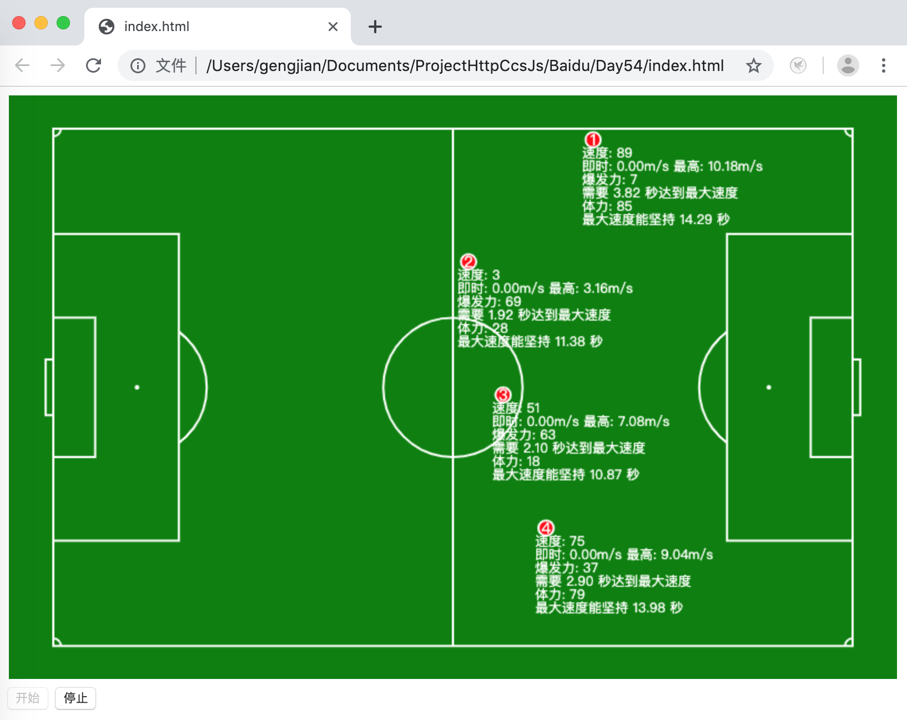

# 百度前端技术学院  
## 第五十四天到第六十六天：足球小将（改）

### 项目展示
展示链接 [[点击进入]](https://gengjian1203.github.io/BaiDuIFE_Day54/)  
预览图如下：

### 项目需求  
通过完成足球小将游戏的练习，来强化对于 JavaScript 的熟悉。  
持续练习如何对于问题进行抽象，应用面向对象或者各种设计模式进行问题的解决。 
可视化的展现一场模拟足球比赛。  
严格要求现实的场地尺寸，按照统一的比例和球场的大小进行对应像素的换算。  
保存两队的比分、以及重点赛况记录。  

### 用到的技术
* 面向对象程序设计
* 工厂模式
* 单例模式
* 事件代理
* Canvas绘图

### 界面
#### 球场区
为展示该项目的主要页面，用以可视化的展示足球赛事情况。  
#### 红队区
将红队的比分展示出来。  
同时，可以随意增加指定属性的红队队员。  
并且可以追踪查看每个人的相关属性，并且会在球场区标记出正在被查看的队员。
#### 蓝队区
将蓝队的比分展示出来。  
同时，可以随意增加指定属性的蓝队队员。  
并且可以追踪查看每个人的相关属性，并且会在球场区标记出正在被查看的队员。
#### 控制面板区
用以控制球赛的开始、暂停节奏。
#### 日志区
用以记录重点的赛况。

### 运动员
球员有很多关于足球运动能力的属性，假设属性与能力呈线性关系，那么详细如下：
#### 速度  
* 速度值为 99 的，最高速度为 12米/秒。
* 速度值为 1 的，最高速度为 3米/秒。
#### 爆发力  
* 爆发力为 99 的，表示能够在 1 秒就达到最高速度
* 爆发力为 1 的，表示需要 4 秒才能达到最高速度
#### 体力
* 体力为 99 的，表示能够在最高速度上坚持 15 秒
* 体力为 1 的，表示能够在最高速度上坚持 10 秒
#### 力量
* 力量为 99 的，运动员踢出足球的最大初速度为 50米/秒
* 力量为 1 的，运动员踢出足球的最大初速度为 5米/秒
#### 技巧
* 技巧为 99 的，运动员踢出足球的最大偏移为 ±1°  
* 技巧为 1 的，运动员踢出足球的最大偏移为 ±10°

### 足球
#### 摩擦力
为了尽量逼真现实效果，足球拥有摩擦力，球被踢出后会慢慢减速，直至停止。  
#### 进门
当球被射进球门，判断属于哪方的得分球门。将比分记录，并且实时的显示出来比分。
另外，展示进球特效，同时，球员原地休息。裁判将足球放回中场。
#### 出界
当球被踢出界外，需要判断球出界位置。  
选择其最近的角球区，又裁判随机角度，将足球发出。

### 环境
* 硬件环境  
MacBook Pro  
* 软件环境  
MacOS (10.14.2)  
VS Code (version 1.36)  
Google Chrome (75.0.3770.100)  
Firefox (67.0.4)  

### 相关链接
[百度前端技术学院-第五十四天到第五十七天：足球小将（一）](http://ife.baidu.com/course/detail/id/62)  
[百度前端技术学院-第五十八天到第六十二天：足球小将（二）](http://ife.baidu.com/course/detail/id/63)  
[百度前端技术学院-第六十三天到第六十六天：足球小将（三）](http://ife.baidu.com/course/detail/id/64)  
